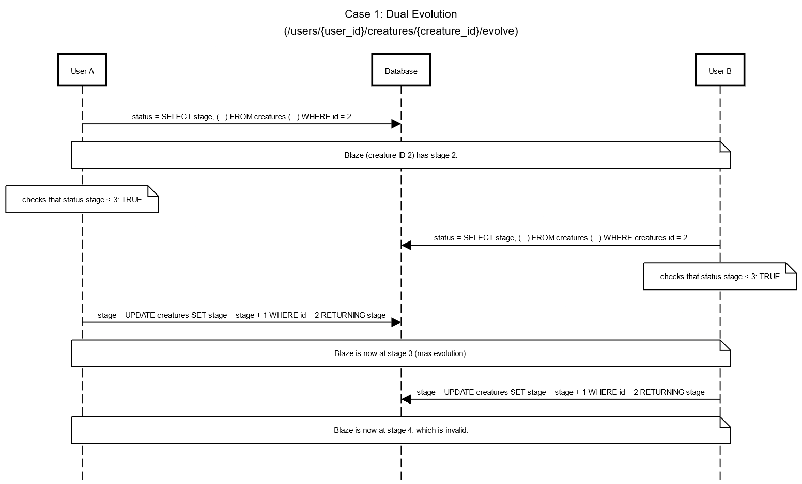
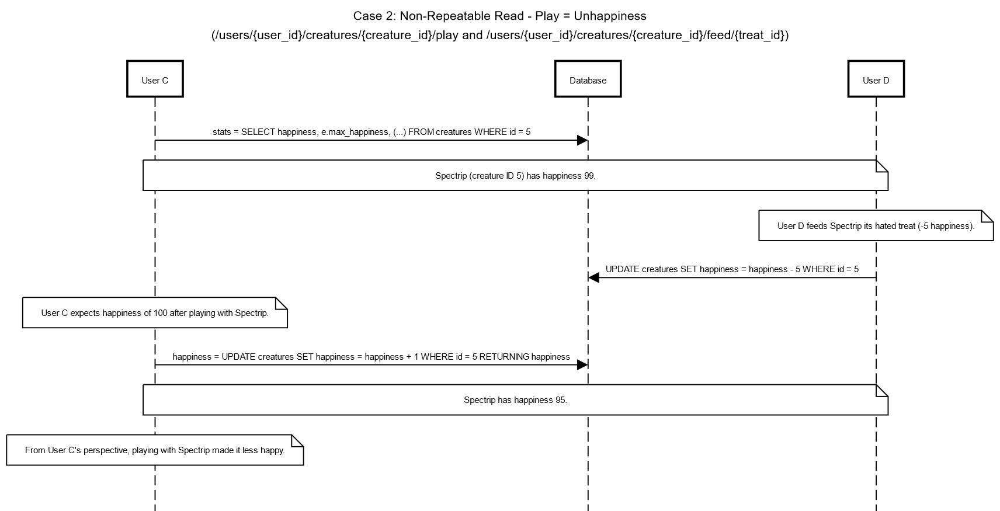
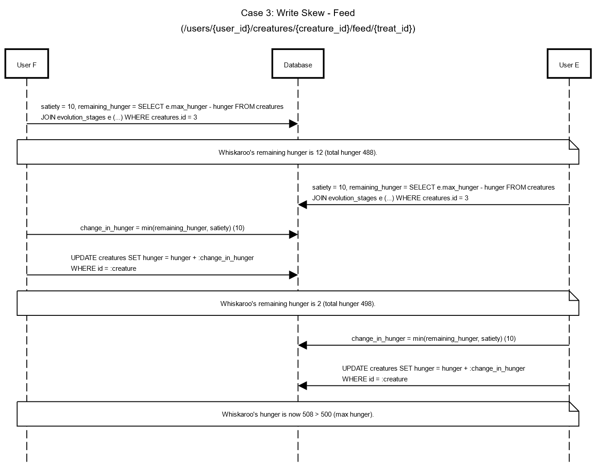

# Concurrency Phenomena

## Case 1: Write Skew - Dual Evolution
This would be the case where multiple different users evolve the same creature at the same time and cause the creature's stage to be invalid.

For example, User A (id `1`), who has adopted the creature named `Blaze` of ID `2`, decides they want to evolve Blaze, who is currently at stage 2, to stage 3.

They call the `POST /users/1/creatures/2/evolve` endpoint, which begins a transaction that selects Blaze's current stage (`2`), and does several checks to make sure that Blaze meets the requirements for evolution, including that User A has adopted Blaze, Blaze has max hunger and happiness, and Blaze's current stage is less than 3.

In the middle of the those checks, another person, User B (id `2`), who has also adopted Blaze, also decides to evolve the creature. User B calls `POST /users/2/creatures/2/evolve`, which begins a second transaction that selects Blaze's current stage (`2`), and does those same checks.

Meanwhile, the first transaction (for User A) finishes its checks and does an `UPDATE` to increment Blaze's stage to `3`. Blaze is now considered to be at max stage of evolution.

Afterwards, User B's transaction, which runs and passes the checks on its stored result for Blaze's stage (`2`), also proceeds to `UPDATE` by incrementing Blaze's stage. However, this results in Blaze having a stage of `4`, which is an invalid value.

Since a creature's stage of evolution determines their max happiness and hunger levels (defined by a table), this would create errors the next time anyone calls any creature interaction endpoint that checks Blaze's maximum stats (no associated values with "stage 4").

### Prevention
This could be solved in multiple ways.
- On a database level, PostgreSQL's isolation level could be set to `REPEATABLE READ`. In this example, this would mean that User A's call would acquire a row-level read lock on Blaze's stats in the creatures table during the transaction, preventing User B's call from reading or modifying Blaze's stats until User A's transaction has finished.
- An additional check could be performed by putting `WHERE stage < 3` in the `UPDATE` statement in the endpoint. This would prevent the row from being updated if it was already maxed out.
  - More reasonably, a constraint `stage < 3` could be applied to the `stage` attribute itself in the table definition.

## Case 2: Non-Repeatable Read - Play = Unhappiness
This case can occur when two interactions are initiated with the same creature concurrently. Since the feed and play endpoints both modify a creature's happiness, it is possible to reach a state where a user sees a happiness level in the response that is inconsistent with the expected behavior from their input.

For example, the creature named `Spectrip` (id  `5`) has happiness level `99` and max happiness `100`. User C (id `3`) decides to play with Spectrip by calling `POST /users/3/creatures/5/play`, which performs a `SELECT` query to get Spectrip's happiness and max happiness levels. At the same time, User D (id `4`) feeds Spectrip a treat by calling `POST /users/4/creatures/5/feed/CRUMBLY_COOKIE`. Unfortunately, `CRUMBLY_COOKIE`s happen to be Spectrip's least favorite treat, so Spectrip's happiness level is updated to be decremented by `5`, bringing it down to `94`.

From the perspective of User C's transaction, Spectrip's happiness level has been read to be `99`. Since this is less than the maximum happiness level, User C expects Spectrip's final happiness to be `99 + 1 = 100`. Instead, when User C's `UPDATE` query runs to increment Spectrip's happiness, it returns a value of `94 + 1 = 95`. User C is understandably confused. From their perspective, playing with Spectrip caused it to become sadder.

### Prevention
This could be solved in a similar way to case 1. PostgreSQL's isolation level could be set to `REPEATABLE READ`, preventing User D from changing Spectrip's happiness until after User C's transaction has finished. User C would not see an unexpected result.

## Case 3: Write Skew - Feed
This case can occur when two users try to feed the same creature concurrently, but the sum of the satiety of both treats is greater than the creature's remaining hunger. This causes the creature's hunger to be greater than its max_hunger (invalid).

Suppose User E (id `9`) tries to feed Whiskaroo (id `3`) at the same time as User F (id `10`). Whiskaroo has initial hunger and max hunger of `488` and `500` respectively.

First, User F calls `POST /users/10/creatures/3/feed/RAZZ_BERRY`, which begins the transaction. The feed endpoint calculates and retrieves Whiskaroo's remaining hunger `12`. Since the satiety of a `RAZZ_BERRY` is `10`, the endpoint calculates the change in hunger for Whiskaroo to be `+10`.

Meanwhile, User E calls `POST /users/9/creatures/3/feed/RAZZ_BERRY`. Similar to the previous case, user F's call completes and updates Whiskaroo's hunger after User E's gets the creature's current stats. Despite Whiskaroo's remaining hunger now being `2`, User E's call still sees it as `12`. Thus, it will calculate the change in hunger for Whiskaroo to be `+10` as well.

Whiskaroo's hunger is now `508`.

Both calls read the same value for Whiskaroo's hunger, so both updates would add the `RAZZ_BERRY` satiety such that Whiskaroo's hunger after both calls (`488 + 10 + 10 = 508`) would be greater than its max_hunger (`500`).

